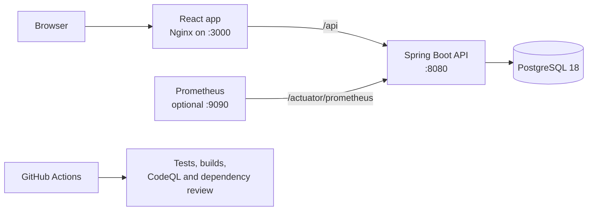
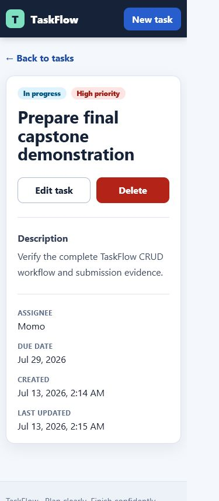

# TaskFlow Capstone

TaskFlow is a full-stack task-management capstone built to demonstrate a clean React, Spring Boot, PostgreSQL, Docker, CI, security, and monitoring workflow. It provides a responsive task interface backed by a validated REST API and persistent PostgreSQL storage.

## Architecture



The browser uses the frontend's same-origin `/api` route. Nginx forwards that route to the backend container, while PostgreSQL remains on a private Docker network and is not published to the host.

## Technology

- Frontend: React, Vite, React Router, Axios, and an unprivileged Nginx production image
- Backend: Java 17, Spring Boot, Maven, Spring Data JPA
- Data: PostgreSQL 18 with a named Docker volume
- Delivery: multi-stage Docker builds and Docker Compose
- Quality: backend verification, frontend lint/test/build, and container smoke checks
- Security: CodeQL, dependency review, Dependabot, least-privilege workflow permissions, and ignored local secrets
- Monitoring: Spring Boot Actuator, Micrometer's Prometheus registry, and an optional local Prometheus service

## Features

- Create, list, view, update, and delete tasks
- Track status, priority, assignee, description, and due date
- Search and filter tasks with URL-backed text, status, and priority controls
- Responsive desktop/mobile layout with accessible navigation and form states
- Structured `400`, `404`, and `500` API errors with field-level validation feedback
- PostgreSQL persistence in the application stack and isolated H2 integration tests
- Health and Prometheus metrics endpoints for observability

## Screenshot



## Repository layout

```text
taskflow-capstone/
|- backend/                 Spring Boot application and container image
|- frontend/                React application and Nginx container image
|- monitoring/              Local Prometheus scrape configuration
|- docs/                    Reproducible demo material and screenshots
|- .github/workflows/       CI and security checks
|- .env.example             Safe local configuration template
`- docker-compose.yml       Full local stack
```

## Run the complete stack

Prerequisites:

- Docker Desktop with Docker Compose
- Git

Create a local environment file. Do not commit it.

```powershell
Copy-Item .env.example .env
```

On macOS or Linux, use `cp .env.example .env` instead. Change the placeholder PostgreSQL password in `.env`, then build and start the application:

```text
docker compose up --build
```

Once all health checks pass:

- Frontend: <http://localhost:3000>
- Backend health: <http://localhost:8080/actuator/health>
- Task API: <http://localhost:8080/api/tasks>

Stop the containers while preserving database data:

```text
docker compose down
```

Delete the local database and Prometheus volumes only when an intentional reset is wanted:

```text
docker compose down -v
```

## Optional monitoring

Start the stack with the monitoring profile:

```text
docker compose --profile monitoring up --build
```

Prometheus is then available at <http://localhost:9090>. Its **Status > Targets** page should show `taskflow-backend` as `UP`. Useful starter queries include:

```promql
jvm_memory_used_bytes
```

```promql
http_server_requests_seconds_count
```

Only the Actuator `health`, `info`, and `prometheus` endpoints are exposed by the container configuration. Do not broaden that list without reviewing the information each endpoint returns.

## Configuration

| Variable | Purpose | Safe local example |
| --- | --- | --- |
| `POSTGRES_DB` | Database name | `taskflow` |
| `POSTGRES_USER` | Local database user | `taskflow` |
| `POSTGRES_PASSWORD` | Local database password | Choose a non-production value in `.env` |
| `BACKEND_PORT` | Host port for the API | `8080` |
| `FRONTEND_PORT` | Host port for the UI | `3000` |
| `PROMETHEUS_PORT` | Host port for optional Prometheus | `9090` |
| `SPRING_PROFILES_ACTIVE` | Spring profile used in containers | `docker` |
| `TASKFLOW_IMAGE_TAG` | Local tag applied to both application images | `local` |

Values prefixed with `VITE_` are compiled into browser code and must never contain passwords, tokens, or private keys.

## Implemented product experience

- Browse task cards and open a dedicated detail page.
- Search by title, description, or assignee and filter by status or priority.
- Create, edit, and delete tasks through the REST API.
- Track title, description, status, priority, assignee, and due date.
- See overdue dates, loading states, empty results, validation feedback, not-found handling, and retryable API errors.
- Keep filters in the URL so the current view remains shareable and refresh-safe.

## Implemented backend API

The current Spring controller exposes these endpoints:

| Method | Path | Purpose |
| --- | --- | --- |
| `POST` | `/api/tasks` | Create a validated task |
| `GET` | `/api/tasks` | List all tasks |
| `GET` | `/api/tasks/{id}` | Retrieve one task |
| `PUT` | `/api/tasks/{id}` | Replace the editable task fields |
| `DELETE` | `/api/tasks/{id}` | Delete a task |

Task input supports a title, description, status, priority, assignee, and due date as applicable to create or update operations. Validation errors and missing tasks are returned through the backend's shared API error handling.

## Verified locally

- Backend: Java 17 `mvn clean verify` with 22 tests and no failures
- Frontend: ESLint clean, 8 Vitest tests passing, and Vite production build successful
- Frontend coverage: 73.46% statements, 60.52% branches, 80% functions, 78.57% lines
- Dependency audit: zero npm vulnerabilities
- Browser workflow: create, list, search/filter, view, update, delete, empty state, validation, and mobile layout
- API smoke workflow: `201`, `200`, `204`, `400`, and `404` responses plus Actuator health and Prometheus metrics
- GitHub Actions syntax: actionlint clean

## Automated checks

Pull requests and pushes to `main` run:

1. Maven verification against a disposable PostgreSQL service.
2. Frontend dependency installation, linting, tests when present, and production build.
3. Docker Compose configuration and application image builds.
4. Trivy gates both application images on actionable high- or critical-severity OS/library vulnerabilities.
5. Container health checks and HTTP smoke tests.
6. CodeQL analysis for Java/Kotlin and JavaScript/TypeScript.
7. Dependency review for newly introduced high- or critical-severity vulnerabilities.

Dependabot checks Maven, npm, Docker, Docker Compose, and GitHub Actions dependencies weekly.

## Secret hygiene

- Commit `.env.example`, never `.env`.
- Use environment variables for database credentials and future signing keys.
- Never put secrets in `VITE_` variables.
- Keep GitHub secret scanning and push protection enabled.
- If a real credential is exposed, revoke and rotate it before cleaning the Git history.

## Demo

Follow [the demo script](docs/demo-script.md) for a short, repeatable walkthrough covering the application, persistence, health checks, monitoring, and CI evidence.

## Scope

The first portfolio release deliberately uses local Docker Compose and free GitHub security checks. Kubernetes, paid hosting, Terraform, Grafana, distributed tracing, and image-registry publishing are outside the initial scope and should only be added for a concrete requirement.
